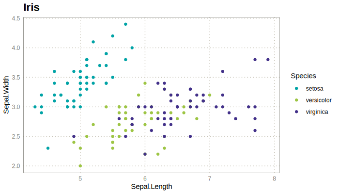
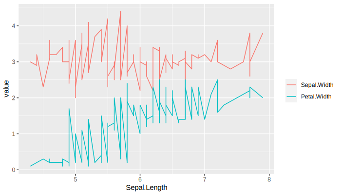
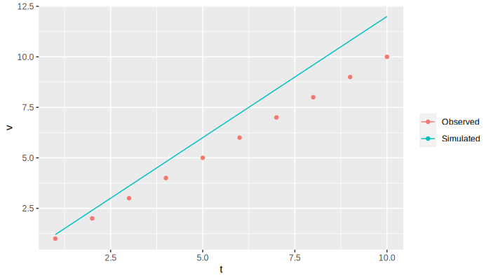
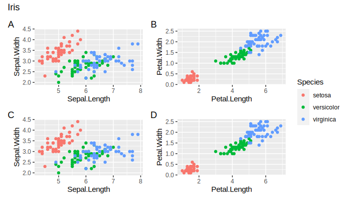

<!-- README.md is generated from README.Rmd. Please edit that file,
then run devtools::build_readme(). -->

# kggplot

<!-- badges: start -->

[](https://github.com/kbosirany/kggplot/actions/workflows/R-CMD-check.yaml)
[](https://app.codecov.io/gh/kbosirany/kggplot)
[](https://lifecycle.r-lib.org/articles/stages.html#experimental)
[](https://www.gnu.org/licenses/agpl-3.0)

<!-- badges: end -->

Site: <https://kbosirany.github.io/kggplot/> (development version:
[/dev](https://kbosirany.github.io/kggplot/dev/))

ggplot2 is powerful, but even a simple figure quickly costs a dozen
lines. **kggplot** draws a complete plot in one short call (data
reshaping, mappings, geometry, titles, theme, palette, legend, facets),
and plots stay composable through the `kggplot` S3 class. It is the
ggplot2 part of [kplot](https://github.com/kbosirany/kplot).

## Installation

``` r
# install.packages("pak")
pak::pak("kbosirany/kggplot")
```

## Example

``` r
library(kggplot)

kggplot(iris, "Sepal.Length", "Sepal.Width", color = "Species",
        title = "Iris", theme = "inrae")
```



``` r

# Several columns in y: long format is handled for you
kggplot(iris, "Sepal.Length", c("Sepal.Width", "Petal.Width"), type = "line")
```



``` r

# Superpose two datasets: shared palette and legend
obs <- data.frame(t = 1:10, v = cumsum(rep(1, 10)))
sim <- data.frame(t = 1:10, v = cumsum(rep(1.2, 10)))

kggplot(obs, "t", "v", color = "Observed", type = "point") +
  kggplot(sim, "t", "v", color = "Simulated", type = "line")
```



``` r

# Several plots in one grid: square layout, a single shared legend
a <- kggplot(iris, "Sepal.Length", "Sepal.Width", color = "Species")
b <- kggplot(iris, "Petal.Length", "Petal.Width", color = "Species")
kgg_grid(a, b, a, b, title = "Iris", tags = "A")
```



See `vignette("kggplot")` (“Get started”) for the full tour: input data,
plot types, titles, themes and palettes, facets, composing plots, grids,
and extending kggplot with your own input classes, plot types and
themes.

Branch, version and release conventions are those of
[kpkg.r](https://github.com/kbosirany/kpkg.r):
`vignette("workflow", package = "kpkg.r")`.
