# Get started with kggplot

ggplot2 is powerful, but even a simple figure quickly costs a dozen
lines: reshape the data to long format, map the aesthetics, pick a
geometry, set the labels, the theme, the palette, the legend…
**kggplot** does all of this in one short call, and the result stays
composable: a `kggplot` object is a *specification* that you can extend,
restyle and combine before it is turned into a regular ggplot.

``` r

library(kggplot)
```

## One call

``` r

kggplot(
  iris, "Sepal.Length", "Sepal.Width", color = "Species",
  title = "Iris", theme = "bw"
)
```

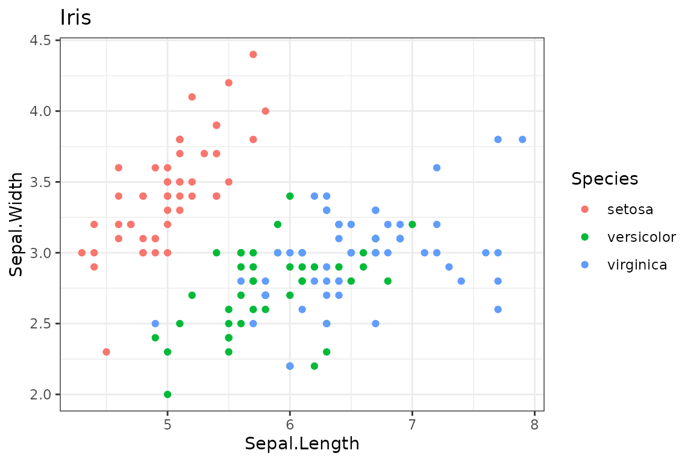

The arguments are column names. Axis and legend titles default to the
variable names, and the plot type is guessed from the data (here a
scatter plot because `x` and `y` are numeric). Everything a single call
handles:

| Concern | Argument | Example |
|----|----|----|
| Input data | `data` (S3 generic [`as_kdata()`](https://kbosirany.github.io/kggplot/dev/reference/as_kdata.md)) | data frame, tibble, `ts`, matrix, vector, named list |
| Reshaping | `y` | `y = c("a", "b")` or `y = "all"`: long format, colour by series |
| Variables | `x y color fill group size shape alpha linetype label` | column names; `I("red")` for a fixed value |
| Plot type | `type` | `"point"`, `"line"`, `"bar"`, `"density"`, `"smooth"`… (guessed if omitted) |
| Titles | `title subtitle caption xlab ylab labels` | `NA` removes a title |
| Theme and palette | `theme base_size palette` | registered names, any `theme_<name>()`, ggplot2 themes |
| Legend | `legend` | `"bottom"`, `"none"`, `c(x, y)` |
| Facets | `facet facet_args` | `"Species"`, `c("row", "col")`, `~ a`, `".series"` |
| Geometry options | `...` | `bins = 10`, `linewidth = 1`, `width = .5` |

## Several variables at once

Give several columns to `y` (or `"all"` for every column but `x`):
kggplot stacks them in long format and colours them by series. The
pseudo-column `".series"` can be mapped to any aesthetic or used as a
facet.

``` r

kggplot(
  iris, "Sepal.Length", c("Sepal.Width", "Petal.Width"),
  type = "point", title = "Two variables, one call"
)
```

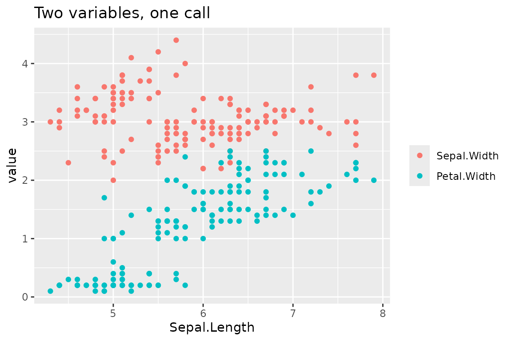

``` r

kggplot(
  iris, "Sepal.Length", c("Sepal.Width", "Petal.Length", "Petal.Width"),
  type = "smooth", facet = ".series", facet_args = list(scales = "free_y"),
  legend = "none"
)
```

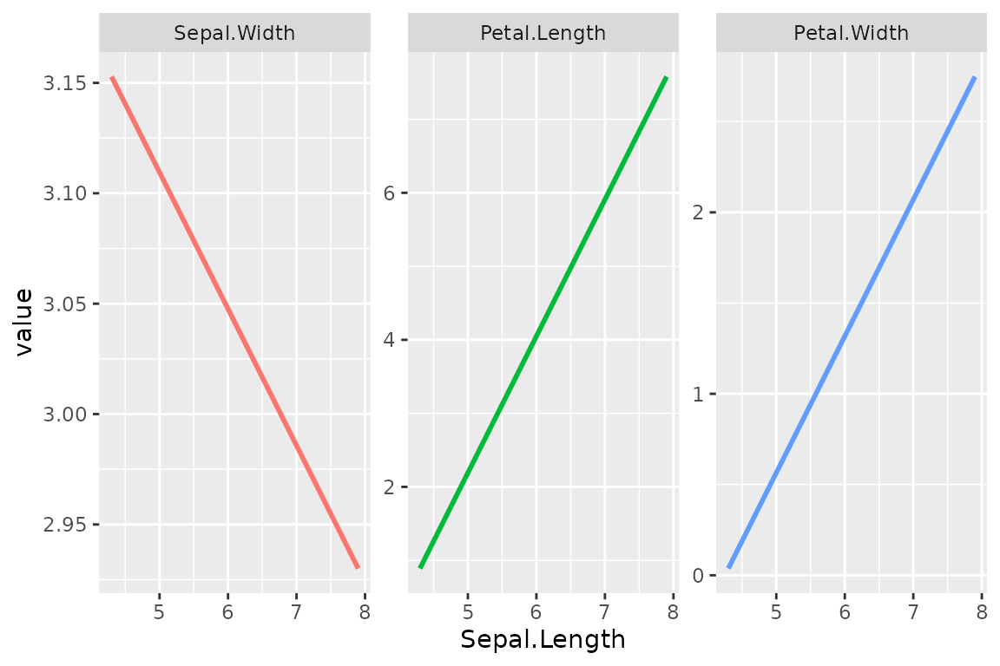

## Other inputs

[`as_kdata()`](https://kbosirany.github.io/kggplot/dev/reference/as_kdata.md)
converts the input to a data frame, so time series, matrices and plain
vectors can be plotted directly:

``` r

kggplot(AirPassengers, title = "Air passengers", theme = "minimal")
```

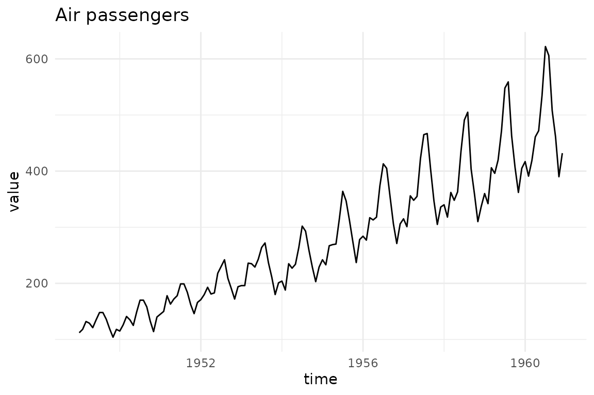

``` r

kggplot(rnorm(200), type = "density", fill = I("grey70"))
```

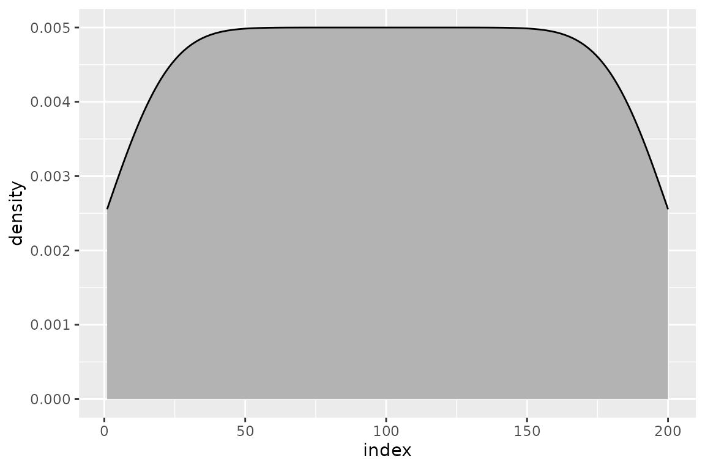

## Plot types

When `type` is omitted it is guessed: a line for dates and time series,
points for a numeric `x` and `y`, bars for a categorical `x`, a
histogram or counts for a lone `x`.
[`kgg_types()`](https://kbosirany.github.io/kggplot/dev/reference/kgg_register_type.md)
lists the available types.

``` r

kgg_types()
#>  [1] "point"      "jitter"     "line"       "path"       "step"      
#>  [6] "area"       "smooth"     "text"       "bar"        "col"       
#> [11] "bar_dodge"  "count"      "histogram"  "density"    "ecdf"      
#> [16] "cumFreq"    "boxplot"    "violin"     "ribbon"     "pointrange"
#> [21] "errorbar"   "hline"      "vline"      "blank"      "convexhull"
```

``` r

kggplot(
  mtcars, "cyl", fill = "gear", type = "count", palette = "okabe_ito",
  title = "Cars by cylinders and gears"
)
#> Warning: The following aesthetics were dropped during statistical transformation: fill.
#> ℹ This can happen when ggplot fails to infer the correct grouping structure in
#>   the data.
#> ℹ Did you forget to specify a `group` aesthetic or to convert a numerical
#>   variable into a factor?
```

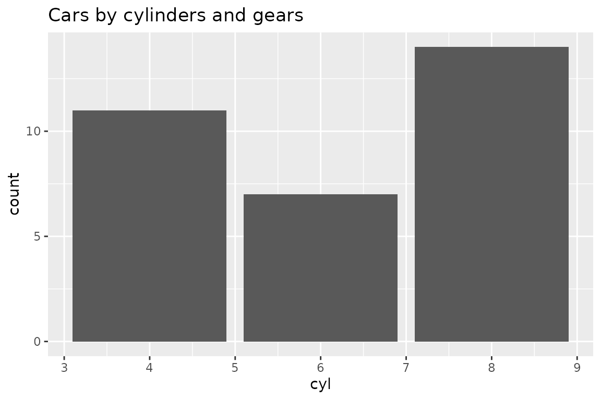

## Titles, legend and facets

``` r

kggplot(
  iris, "Sepal.Length", "Sepal.Width", color = "Species",
  title = "Iris", subtitle = "Sepals", caption = "Source: datasets::iris",
  xlab = "Length (cm)", ylab = "Width (cm)", labels = list(color = "Species"),
  legend = "bottom", facet = "Species", theme = "bw", base_size = 11
)
```

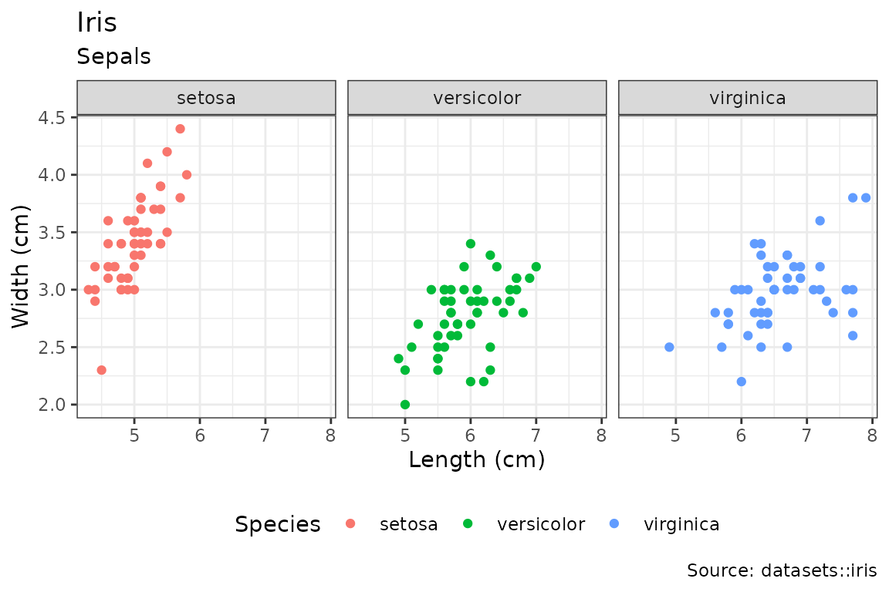

A character value that is not a column, given to `color`, `fill` or
`group`, creates a legend entry (`color = "Observed"`). Use `I("red")`
for a fixed colour.

## Themes and palettes

A theme bundles a ggplot2 theme and a colour palette under one name.
[`kgg_themes()`](https://kbosirany.github.io/kggplot/dev/reference/kgg_register_theme.md)
and
[`kgg_palettes()`](https://kbosirany.github.io/kggplot/dev/reference/kgg_register_theme.md)
list the registered ones; any `theme_<name>()` function on the search
path also works (`theme = "light"`).

``` r

kggplot(
  iris, "Sepal.Length", "Sepal.Width", color = "Species", facet = "Species",
  theme = "inrae"
)
```

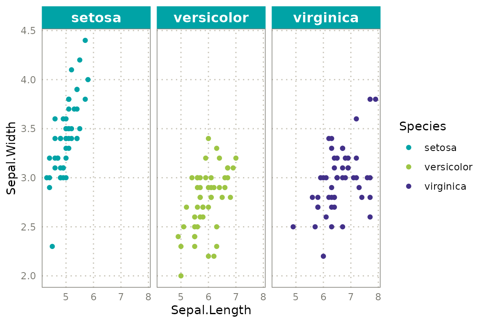

The built-in `"inrae"` theme uses the colours of the INRAE graphic
charter. The charter sets Raleway for titles and Avenir Next Pro
Condensed for text; these fonts must be installed, so kggplot forces
none. Opt in with:

``` r

options(
  kggplot.title_family = "Raleway",
  kggplot.base_family = "Avenir Next Condensed"
)
```

Set `options(kggplot.theme = "inrae")` to make a theme the default for
the session.

## Composing plots

Because a `kggplot` is a specification, plots can be combined. Layers
share one palette and one legend, so a level keeps its colour whatever
layer it comes from.

``` r

obs <- data.frame(t = 1:10, v = cumsum(rep(1, 10)))
sim <- data.frame(t = 1:10, v = cumsum(rep(1.2, 10)))

kggplot(obs, "t", "v", color = "Observed", type = "point", theme = "inrae") +
  kggplot(sim, "t", "v", color = "Simulated", type = "line")
```

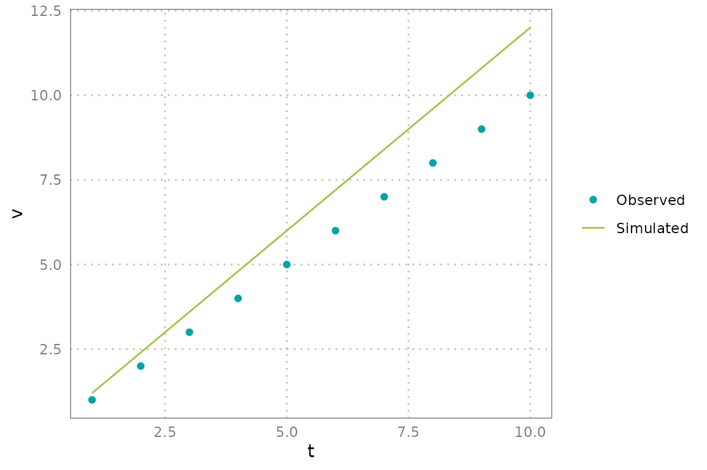

`kggplot(p, sim, ...)` and `kgg_add(p, sim, ...)` do the same as `+` and
inherit the mappings of the first layer when the columns exist in the
new data. Without new data,
[`kgg_add()`](https://kbosirany.github.io/kggplot/dev/reference/kgg_modify.md)
reuses the first layer’s data, which is handy for adding a smoother:

``` r

kggplot(iris, "Sepal.Length", "Sepal.Width", color = "Species") |>
  kgg_add(type = "smooth")
```

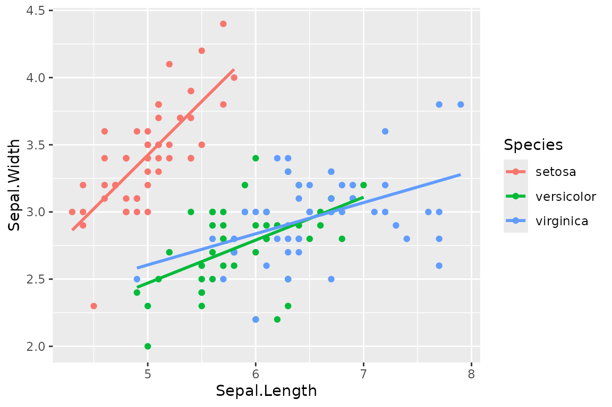

Any ggplot2 component can be added with `+`; it is applied last:

``` r

kggplot(iris, "Sepal.Length", "Sepal.Width", theme = "minimal") +
  ggplot2::geom_hline(yintercept = 3, linetype = "dashed") +
  ggplot2::scale_x_log10()
```

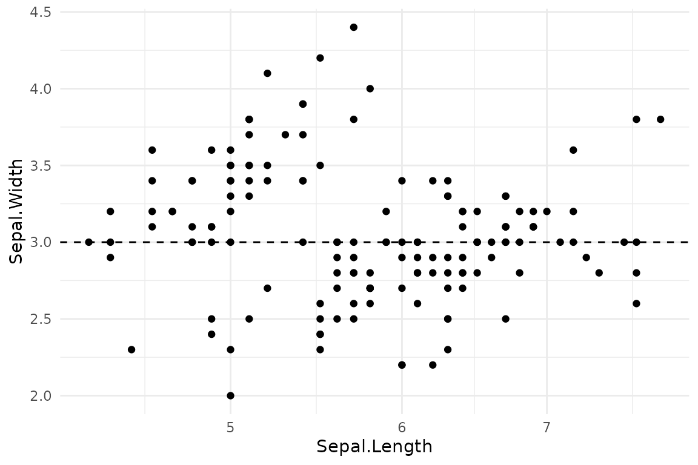

Pipe-friendly modifiers change one thing at a time and leave the
original untouched:

``` r

p <- kggplot(iris, "Sepal.Length", "Sepal.Width", color = "Species")

p |>
  kgg_labs(title = "New title", x = "Sepal length") |>
  kgg_theme("bw", base_size = 14) |>
  kgg_facet("Species", scales = "free") |>
  kgg_legend("bottom")
```

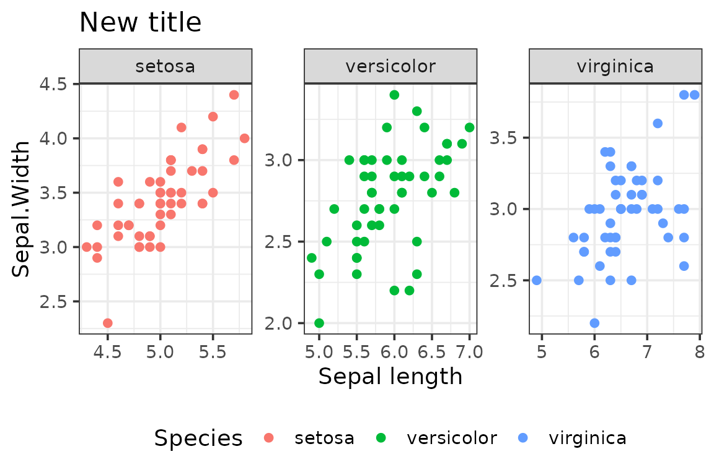

## Bands, error bars, reference lines and panel limits

Four more building blocks make a multi-panel scientific figure possible
with
[`kggplot()`](https://kbosirany.github.io/kggplot/dev/reference/kggplot.md)
and `+` only:

- **`ribbon`** draws a band between the `ymin` and `ymax` columns,
  filled with the series colour (`alpha = 0.2`, no outline). With
  several `y` columns, `ymin` and `ymax` take one column per `y`, in the
  same order (or a single column, shared by every series).
- **`pointrange`** and **`errorbar`** draw a point and its range, in
  black and not coloured by series (map `color` to override).
- **[`kgg_hline()`](https://kbosirany.github.io/kggplot/dev/reference/kgg_reference.md)**
  and
  **[`kgg_vline()`](https://kbosirany.github.io/kggplot/dev/reference/kgg_reference.md)**
  add reference lines. Give the positions as a vector to draw them in
  every panel, or a data frame holding the facet column to draw them in
  the matching panels only. Fixed appearance goes in the arguments:
  `linetype = "dashed"`, `color = I("grey40")`.
- **[`kgg_limits()`](https://kbosirany.github.io/kggplot/dev/reference/kgg_reference.md)**
  forces the range of the axes of some panels, which matters with free
  scales: it draws nothing but trains the scales.

Layers with their own data share the panels of a facet variable, in the
same order, and a series keeps its colour across layers.

``` r

dates <- seq(as.Date("2024-05-01"), by = "day", length.out = 60)
panels <- c("LAI", "Available water ratio", "Irrigation")
simulate <- function(simulation, shift) {
  lai <- pmax(0, 3 * sin(seq(0, pi, length.out = 60)) + shift)
  awr <- pmin(1, pmax(0, 0.8 - seq(0, 0.5, length.out = 60) + shift / 10))
  irr <- ifelse(seq_along(dates) %% 10 == 0, 20 + 5 * shift, 0)
  data.frame(
    date = rep(dates, 3), simulation = simulation,
    panel = factor(rep(panels, each = 60), levels = panels),
    mean = c(lai, awr, irr), sd = c(rep(0.3, 60), rep(0.08, 60), rep(0, 60))
  )
}
sims <- rbind(simulate("Simulation", 0), simulate("Reference", 0.4))
sims$lo <- sims$mean - sims$sd
sims$hi <- sims$mean + sims$sd
curves <- sims[sims$panel != "Irrigation", ]
irrigation <- sims[sims$panel == "Irrigation" & sims$mean > 0, ]

obs <- data.frame(
  date = dates[c(10, 25, 40, 55)], lai = c(0.8, 2.4, 2.6, 1.1),
  panel = factor("LAI", levels = panels)
)
obs$lo <- obs$lai - 0.25
obs$hi <- obs$lai + 0.25
threshold <- data.frame(
  panel = factor("Available water ratio", levels = panels), y = 0.4
)
colors <- c(Simulation = "#00a3a6", Reference = "#e07a5f")

kggplot(
  curves, "date", "mean", ymin = "lo", ymax = "hi", fill = "simulation",
  type = "ribbon", palette = colors, theme = "inrae", legend = "bottom",
  facet = panel ~ ., facet_args = list(scales = "free_y", switch = "y"),
  xlab = NA, ylab = NA, labels = list(color = NA, fill = NA)
) +
  kggplot(curves, "date", "mean", color = "simulation", type = "line",
          linewidth = 0.8) +
  kggplot(irrigation, "date", "mean", fill = "simulation", type = "bar_dodge",
          width = 0.9, position = "dodge") +
  kggplot(obs, "date", "lai", ymin = "lo", ymax = "hi", type = "pointrange") +
  kgg_hline(data = threshold, yintercept = "y", linetype = "dashed",
            color = I("grey40")) +
  kgg_vline(dates[c(15, 30, 45)], linetype = "dotted", color = I("grey60")) +
  kgg_limits(panel = "Available water ratio", y = c(0, 1))
```

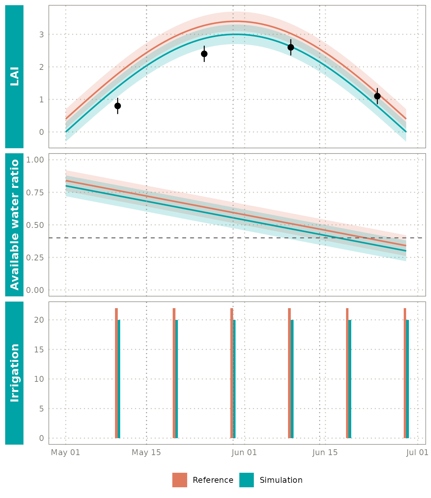

A formula such as `panel ~ .` gives a column of panels; `switch = "y"`
moves the strips to the left and places them outside the axes. `NA`
removes a title: here the axis titles and the legend title.

## Going back to ggplot2

[`as_ggplot()`](https://kbosirany.github.io/kggplot/dev/reference/as_ggplot.md)
renders the specification into a regular `ggplot` object, for anything
that is easier in plain ggplot2.
[`kgg_save()`](https://kbosirany.github.io/kggplot/dev/reference/kgg_save.md)
and
[`ggplot2::autoplot()`](https://ggplot2.tidyverse.org/reference/autoplot.html)
also accept a `kggplot`.

``` r

g <- as_ggplot(p)
class(g)
#> [1] "ggplot2::ggplot" "ggplot"          "ggplot2::gg"     "S7_object"      
#> [5] "gg"
```

## Extending kggplot

Everything is S3 or a registry:

- **New input class**: define an
  [`as_kdata()`](https://kbosirany.github.io/kggplot/dev/reference/as_kdata.md)
  method returning a data frame.
- **New plot type**:
  [`kgg_register_type()`](https://kbosirany.github.io/kggplot/dev/reference/kgg_register_type.md)
  maps a name to a geom function.
- **New theme or palette**:
  [`kgg_register_theme()`](https://kbosirany.github.io/kggplot/dev/reference/kgg_register_theme.md)
  and
  [`kgg_register_palette()`](https://kbosirany.github.io/kggplot/dev/reference/kgg_register_theme.md).

``` r

kgg_register_palette("traffic", c("#2ecc71", "#f1c40f", "#e74c3c"))
kgg_register_theme("traffic", ggplot2::theme_bw, palette = "traffic")
kgg_register_type("hollow", ggplot2::geom_point, params = list(shape = 1))

kggplot(
  iris, "Sepal.Length", "Sepal.Width", color = "Species",
  type = "hollow", theme = "traffic"
)
```

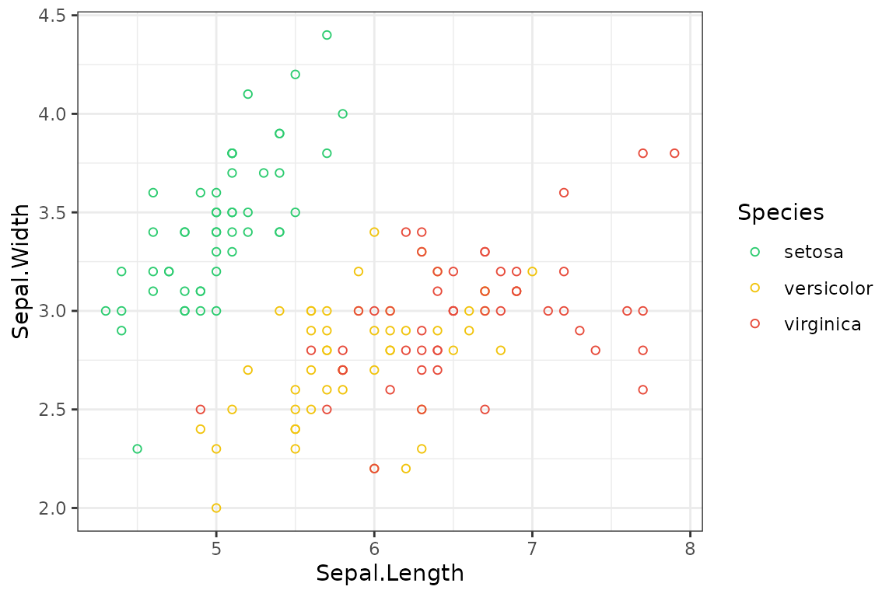
